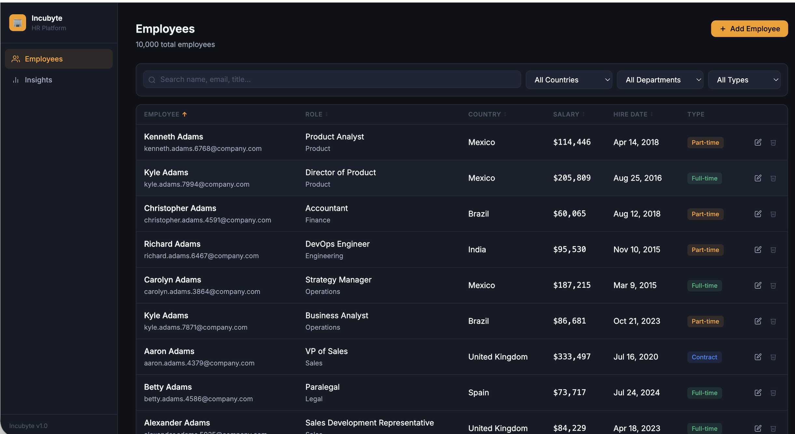
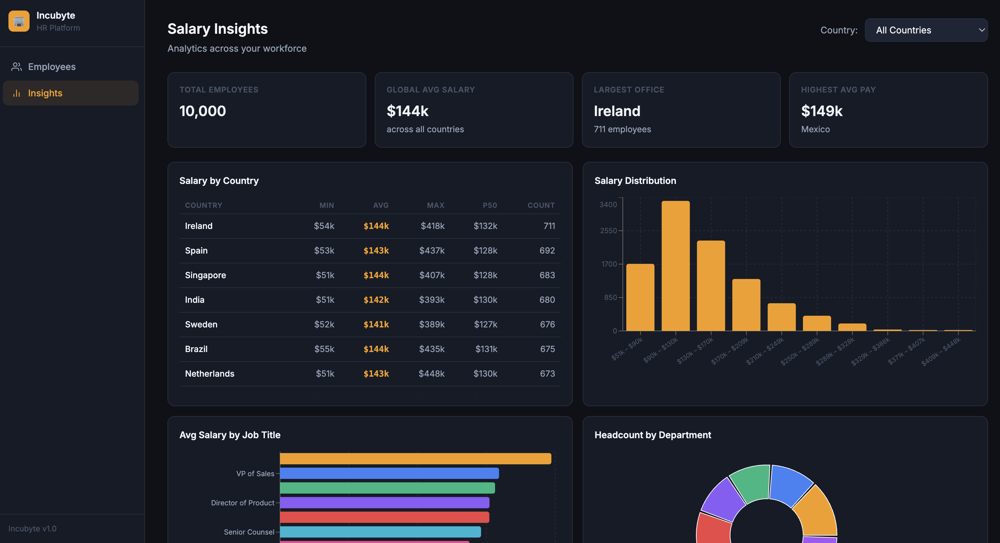
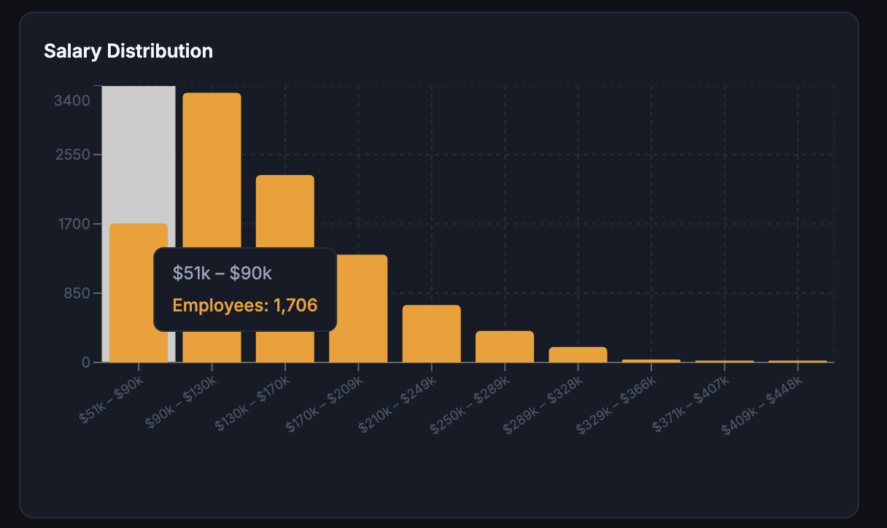

# 🚀 Incubyte — Salary Management Tool


A production-grade HR salary management platform for organisations with up to **10,000 employees**, built using **Ruby on Rails (API)**, **PostgreSQL**, and **React + Vite** with a strict **TDD approach**.

---

## 📸 Screenshots

### 👥 Employees Dashboard


### 📊 Salary Insights


### 📈 Salary Distribution Histogram


> Place screenshots inside a `/docs` folder

---

## ✨ Features

### Employee Management
- Add, update, and soft-delete employees
- Filter by country, department, employment type
- Full-text search (name, email, job title)
- Sorting + pagination (50 per page)

### Analytics & Insights
- Salary stats: min / max / avg / percentiles (P25, P50, P75, P90)
- Salary by job title (filterable by country)
- Department breakdowns
- Salary distribution histogram
- Top 10 earners

### Performance
- 10,000 records seeded in < 1 second
- SQL-based analytics (no Ruby loops)
- Optimised indexing strategy

---

## 🧱 Tech Stack

| Layer      | Technology |
|------------|-----------|
| Backend    | Ruby on Rails 7.1 (API) |
| Database   | PostgreSQL |
| Serializer | Blueprinter |
| Frontend   | React 18 + Vite |
| Charts     | Recharts |
| Testing    | RSpec, FactoryBot, Vitest |

---

## 🏗️ Architecture

```
Frontend (React + Vite)
        ↓
Rails API (Controllers → SQL)
        ↓
PostgreSQL (Indexed + Analytical Queries)
```

### Key Decisions
- SQL-first analytics for performance
- Soft delete (`is_active`) to preserve history
- Thin controllers, logic in queries/scopes
- No N+1 queries

---

## 🚀 Getting Started

### Prerequisites

- Ruby 3.3
- PostgreSQL 14+
- Node.js 18+

---

### Backend Setup

```bash
cd backend

bundle install

export DB_USERNAME=postgres
export DB_PASSWORD=password

rails db:create
rails db:migrate
rails db:seed

rails server -p 3001
```

Verify:

```bash
curl http://localhost:3001/health
```

---

### Frontend Setup

```bash
cd frontend

npm install
npm run dev
```

Open: http://localhost:3000

---

## 🧪 Running Tests

### Backend

```bash
bundle exec rspec
```

### Frontend

```bash
npm run test
```

---

## 📡 API Overview

### Employees

| Method | Endpoint |
|--------|---------|
| GET | /api/v1/employees |
| POST | /api/v1/employees |
| PUT | /api/v1/employees/:id |
| DELETE | /api/v1/employees/:id |

---

### Insights

| Endpoint |
|----------|
| /api/v1/insights/salary_by_country |
| /api/v1/insights/salary_distribution |
| /api/v1/insights/top_earners |

---

## ⚡ Performance Highlights

- Batch inserts using `insert_all`
- Aggregations using SQL (`PERCENTILE_CONT`, `WIDTH_BUCKET`)
- Indexed queries for fast filtering
- Debounced frontend search

---

## ⚖️ Trade-offs

| Decision | Limitation |
|----------|-----------|
| No caching | Recomputes analytics |
| LIKE search | Not scalable beyond 100k rows |
| Single DB | No horizontal scaling |

---

## 🔥 Scaling Plan

- Add Redis caching
- Introduce read replicas
- Precompute analytics
- Add multi-tenancy

---

## 🛠️ Deployment

- Backend: Docker + Puma + Nginx
- Frontend: Vercel / Netlify
- Database: AWS RDS
- Cache: Redis

---

## 🔮 Future Enhancements

- JWT Authentication
- CSV/PDF exports
- Multi-currency support
- Salary trend analysis
- ML-based salary benchmarking

---

## 👨‍💻 Author

Rakshit  
Software Engineer (Ruby on Rails)

---

## ⭐ Support

If you found this useful, give it a ⭐ on GitHub!

---

## 🧾 License

MIT
